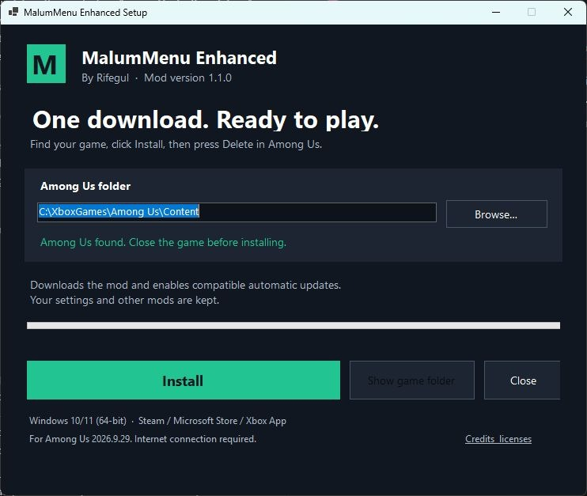
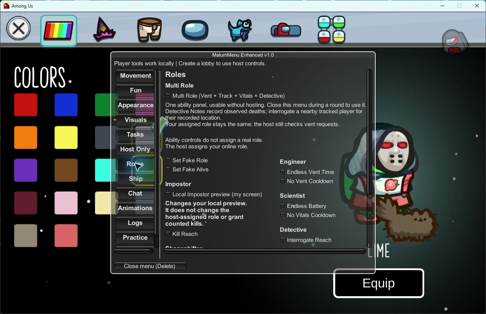

# MalumMenu Enhanced

An Among Us mod menu by **Rifegul**.

## Download

**[Download the all-in-one installer](downloads/setup/MalumMenuEnhancedSetup.exe?raw=true)**

1. Close Among Us.
2. Open the downloaded file and click **Install**.
3. Open Among Us normally. Press **Delete** to open the menu.

The installer finds your game and downloads everything it needs. If it cannot
find Among Us, click **Browse** and select `Among Us.exe`. Your settings are
preserved, and the previous menu is backed up.

Windows 10/11, 64-bit. For Among Us **2026.9.29**. Automatic installation supports
**Xbox App / Microsoft Store only**. Epic Games needs the untested manual
installation path. Steam is not supported by this installer.

## Screenshots

## Features

- Multi Role: vent access, tracking, Vitals and Detective tools.
- Sprint, follow, orbit, teleport and Lag Mode.
- Manual task automation and AI Tasks.
- Appearance controls and random outfits.
- Separate host controls, including Ghost Voting.

Some actions need host support. See [feature details](FORK.md) for tested limits.

[Manual installation](docs/INSTALL.md) · [Source](downloads/v1.0/MalumMenuEnhanced-1.0-Source.zip) · [Build instructions](installer/README.md)

Based on MalumMenu by **scp222thj** and **astra1dev (Astral)**.
[Credits](CREDITS.md) · [GPL-3.0 license](LICENSE)

This mod is not affiliated with or endorsed by Innersloth LLC. Among Us belongs
to Innersloth LLC.
